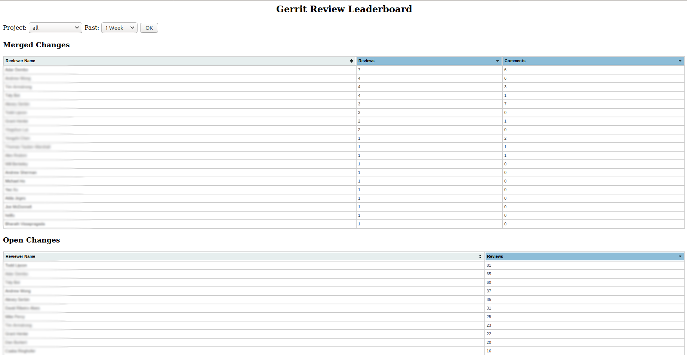

# Gerrit Review Leaderboard

Simple Python Django web application that shows leaderboards for gerrit
reviewers ranking them based on review count or comment count. Leaderboards
shown are for merged changes and open changes. Filters are available Gerrit
projects discovered and for periods of a week, a month, 3 months, or 6 months.

The application connects to a gerrit server using SSH (using Pygerrit/Python
Paramiko) using a configured SSH private key, and pulls down Gerrit 'changes'
into an sqlite database, which is then used by Django to render the leaderboard
tables. Configuration for connecting to the gerrit server, and for amount of
changes to pull down is specified in a config file. Initial fetch pulls in all
changes for a period specified, after which subsequent fetches only pull in
newly merged changes.

## Run using docker

Do the following on a host machine with docker installed to quickly get going:

* Clone the repository:

        git clone git@github.com:akarollil/gerrit-review-leaderboard.git

* Build a docker image:

        docker build -t gerrit-review-board .

* On the Gerrit server *gerrit-server* you are interested in, create a
  read-only user *gerrit-user* for using to fetch changes via SSH. Create an
  SSH key pair, and install the public key for the user on the server. Save the
  *SSH private key* on the host machine being setup.
* Run container:

        docker run -ti -v <path to SSH private key>:/var/www/.ssh/id_rsa \
            gerrit-review-board -s <gerrit-server> -u <gerrit-user>

## Run a test server and tests

### Install dependencies

* Install django, setup-tools, pip

        sudo apt-get install python3-django python3-setuptools python3-pip

* Install version of pygerrit tweaked to retrieve more info about reviews

        pip3 install git+https://git@github.com/akarollil/pygerrit.git#egg=pygerrit-master

### Run test server

* Run the following command from django-gerrit-review-leaderboard to apply
   django migrations to database:

        PYTHONPATH=.:$PYTHONPATH python3 ../django-site/manage.py migrate
* Run the following command from django-gerrit-review-leaderboard to run the
   test server:

        PYTHONPATH=.:$PYTHONPATH python3 ../django-site/manage.py runserver
* Navigate to 127.0.0.1:8000 (or whatever URL runserver prints) in your browser. 
   This will show an incomplete page.
* Update newly created django-site/fetcher.cfg with gerrit server hostname,
   username, port.
* Make sure SSH private key for username configured in django-site/fetcher.cfg
   is present in ~/.ssh/id_rsa for user running runserver command
* Refresh the browser page - you should see the debug server printing out fetch
   statements, and the browser should display review leaderboards.

### Run tests

Run the following command from django-gerrit-review-leaderboard

        PYTHONPATH=.:$PYTHONPATH python3 ../django-site/manage.py test

## TODO

* Pull data in the background and refresh once fetch is complete
* Use database for storing gerrit server configuration and SSH private key
* Re-use gerrit SSH connection if possible
* Sort project list based on number of reviews in project
* Automatic pulling in of changes periodically (for HUD)
* Automate refresh of web page with cycling of projects (for HUD)